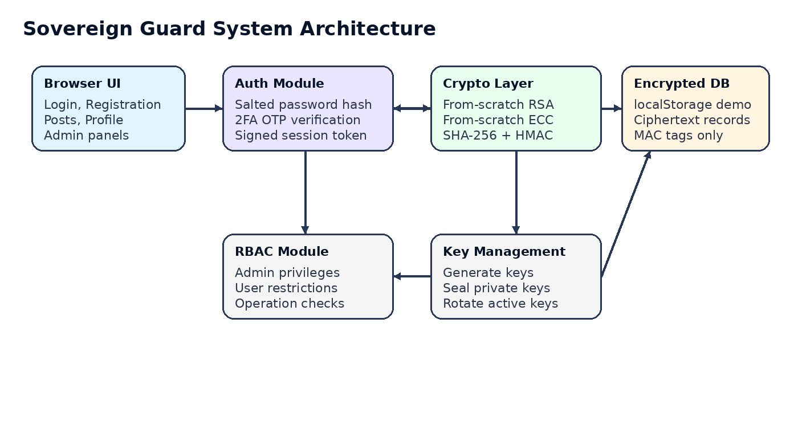
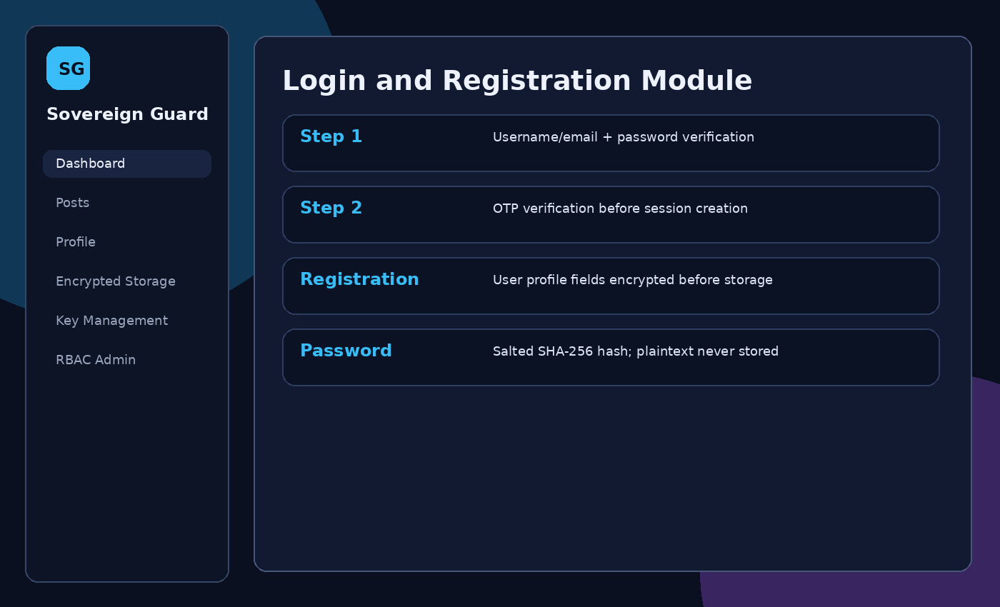
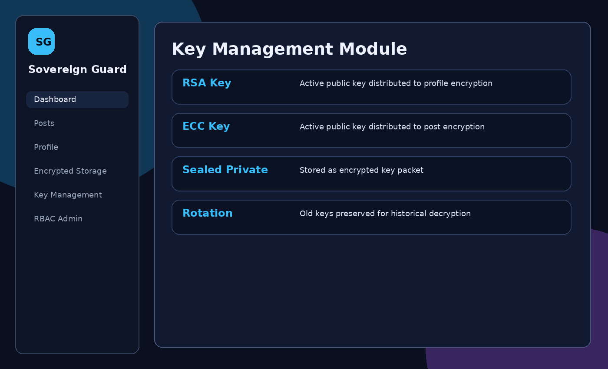
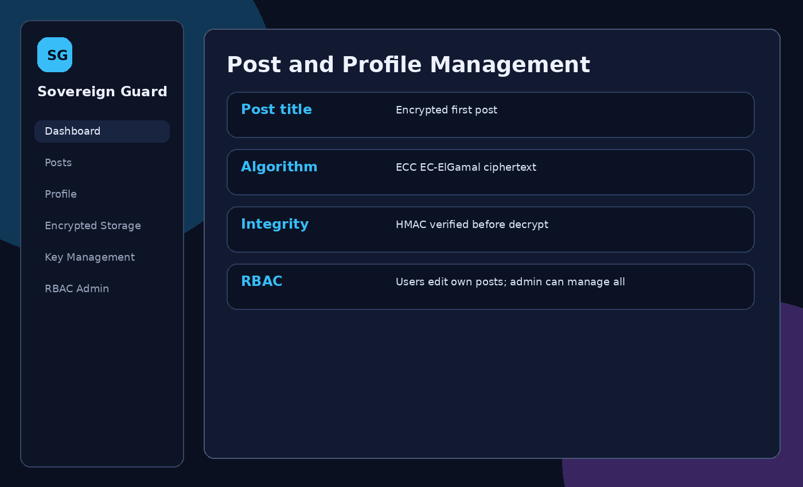
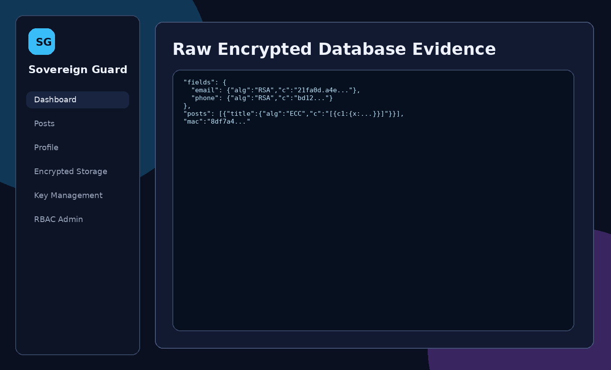

# Title Page

**Department of Computer Science and Engineering**  
**Course:** CSE447: Cryptography and Cryptanalysis  
**Semester:** Spring 2026  
**Project Report**

**Title:** Sovereign Guard: Secure System for User Data and Social Posts using RSA/ECC

**Submitted To:** [Instructor Name]  
**Group No:** [Update]  
**Section:** [Update]  
**Submission Date:** [DD Month YYYY]

| No. | Full Name | Student ID |
|---:|---|---|
| 1 | [Member 1 Full Name] | [Member 1 Student ID] |
| 2 | [Member 2 Full Name] | [Member 2 Student ID] |
| 3 | [Member 3 Full Name] | [Member 3 Student ID] |

# 1. Introduction and System Overview

This report documents the design, implementation, and security analysis of **Sovereign Guard**, a secure web application for encrypted account management and encrypted social posts. The system implements multiple cryptographic operations from scratch and demonstrates how user data, profile records, posts, key metadata, and session tokens can be protected even if the application storage is inspected directly.

The application was developed as a browser-based coursework prototype. It stores encrypted records in browser `localStorage` so the raw storage can be viewed as evidence. Plaintext user information and social post content are not stored directly. Instead, records are encrypted before storage, verified with a Message Authentication Code before reading, and decrypted only inside the application after successful authorization.

## 1.1 Project Overview

Sovereign Guard allows users to register, log in with two-factor verification, manage profiles, and create or edit social posts. Administrators have additional authority to view the RBAC admin panel, inspect encrypted user summaries, rotate cryptographic keys, and manage sensitive operations.

The main security goals are:

- Prevent plaintext access to sensitive user and post data in storage.
- Use salted password hashes instead of storing plaintext passwords.
- Enforce two-step authentication before creating a session.
- Use at least two asymmetric algorithms: RSA for user/profile data and ECC for post data.
- Verify data integrity with a MAC before decryption and display.
- Restrict sensitive operations through role-based access control.
- Protect session tokens with signature, MAC, expiry time, and browser `sessionStorage`.

## 1.2 Technology Stack

| Layer | Technology / Approach |
|---|---|
| Frontend | HTML5, CSS3, JavaScript |
| Storage | Browser `localStorage` for encrypted demo database |
| Session Store | Browser `sessionStorage` |
| RSA | Implemented from scratch using JavaScript `BigInt`, modular exponentiation, modular inverse, and toy classroom primes |
| ECC | Implemented from scratch using elliptic-curve point addition, point doubling, scalar multiplication, and EC-ElGamal-style encryption |
| Hashing | SHA-256 implemented from scratch |
| MAC | HMAC-SHA256 implemented from scratch |
| External crypto libraries | None |

## 1.3 System Architecture Diagram



# 2. Login and Registration Module

The system provides secure registration and login flows. During registration, user profile fields are encrypted before storage. During login, stored encrypted user identifiers are decrypted only inside the application for credential matching. Passwords are never decrypted because they are not encrypted; they are salted and hashed.



## 2.1 Registration Flow

1. The user enters full name, username, email, contact number, password, and role.
2. If the selected role is administrator, the system requires the admin invite code.
3. A random salt is generated for the password.
4. The password hash is calculated as an iterative SHA-256 digest using the salt and password.
5. A two-factor OTP secret is generated.
6. User profile fields are encrypted with the active RSA public key.
7. The OTP secret is encrypted with RSA.
8. A HMAC tag is calculated over the encrypted user record.
9. The ciphertext record, salt, password hash, OTP ciphertext, role, key ID, and MAC are stored.

## 2.2 Login Flow

1. The user enters username/email and password.
2. The system scans encrypted user records, verifies each record's HMAC, decrypts username/email, and finds the matching user.
3. The stored salt is retrieved.
4. The entered password is re-hashed with the same salt.
5. The calculated hash is compared with the stored hash.
6. If the password is correct, the system moves to OTP verification.
7. If OTP is correct, a signed session token is issued.

## 2.3 Implementation Details

| Requirement | Implementation Details |
|---|---|
| Login Module | Decrypts stored RSA-encrypted username/email for matching, verifies salted password hash, then requires OTP. |
| Registration Module | Collects name, username, email, phone, password, and role. Admin registration requires invite code `SOVEREIGN-ADMIN`. |
| Data Encrypted Before Storage | Name, username, email, phone, and OTP secret are encrypted with RSA. |
| Data Decrypted on Retrieval | User/profile fields are decrypted after HMAC verification using the private key sealed in the key registry. |

# 3. User Data Encryption and Decryption

All sensitive user information is encrypted before storage using RSA. Post data uses ECC so the project uses two different asymmetric encryption approaches rather than one algorithm for all encryption.

## 3.1 Fields Encrypted

| Data Type | Fields | Algorithm |
|---|---|---|
| User account | name, username, email, phone | RSA |
| OTP setup | OTP secret | RSA |
| Profile update | name, email, phone | RSA |
| Social post | title, tags, body | ECC / EC-ElGamal-style encryption |
| Key registry | private key records | RSA sealed key packets |

## 3.2 Encryption Algorithm - RSA Implementation

The RSA module is implemented manually in JavaScript. It includes:

- Prime selection from a classroom prime pool.
- Modulus calculation `n = p * q`.
- Euler totient calculation `phi = (p - 1)(q - 1)`.
- Public exponent selection, usually `e = 65537`.
- Private exponent calculation using the extended Euclidean algorithm.
- Modular exponentiation using square-and-multiply.
- Character-wise encryption and decryption for educational demonstration.
- RSA signing for session token integrity.

The implementation is intentionally small-key and educational so that it can run in the browser and be inspected by instructors. Production RSA would require secure random generation, large key sizes, padding such as OAEP/PSS, side-channel protection, and mature audited libraries.

## 3.3 Encryption Algorithm - ECC Implementation

The ECC module is also implemented manually. It includes:

- A small educational curve over a finite prime field.
- Point addition and point doubling.
- Scalar multiplication using double-and-add.
- Plaintext byte-to-point mapping.
- EC-ElGamal-style encryption, where each plaintext point is protected using an ephemeral scalar and the receiver's public key.
- ECC decryption by removing the shared point generated from the private key and ciphertext point.

Like the RSA implementation, this ECC design is for coursework demonstration, not production deployment.

## 3.4 How Both Algorithms Are Used Differently

RSA and ECC are used for different parts of the system:

| Area | Algorithm | Reason |
|---|---|---|
| Registration and profile fields | RSA | Straightforward public-key encryption of short user fields. |
| OTP secret storage | RSA | Keeps the second-factor seed encrypted in storage. |
| Post title, tags, body | ECC | Demonstrates a different asymmetric encryption mechanism for social content. |
| Session token signing | RSA | Signs the session payload and verifies it on protected actions. |
| MAC | HMAC-SHA256 | Verifies record integrity; it is not used for encryption. |

# 4. Password Hashing and Salting

Passwords are never stored in plaintext. During registration, the system generates a unique salt and combines it with the password before hashing. During login, the same salt is reused to verify the entered password.

## 4.1 Hashing Algorithm Used

The project uses a from-scratch SHA-256 implementation. The password hash is generated iteratively so that a single password check requires repeated hashing. This slows down simple brute-force attempts compared with one direct hash.

## 4.2 Salt Generation

A random hexadecimal salt is generated per user account. The salt is stored beside the hash because it is not secret. Its purpose is to make identical passwords produce different hashes and reduce the usefulness of rainbow-table attacks.

## 4.3 Verification Process

1. Retrieve the user's stored salt and password hash.
2. Combine the submitted password with the stored salt.
3. Run the same iterative SHA-256 function.
4. Compare the calculated hash to the stored hash.
5. Continue to OTP verification only if the hashes match.

# 5. Two-Factor Authentication (2FA)

The application enforces two-step authentication. Passing the password check alone is not enough to enter the system. The user must also pass a second-factor OTP check.

## 5.1 2FA Method

The OTP is generated using a from-scratch HMAC-SHA256 function over a time window and the user's encrypted OTP secret. During login, the application decrypts the OTP secret after password verification and calculates the current six-digit OTP. For classroom testing, the OTP is displayed after the password step so the 2FA flow can be demonstrated without SMS or email services.

## 5.2 Code Snippet

```javascript
const otp = (secret) =>
  String(
    parseInt(hmac(secret, String(Math.floor(Date.now() / 30000))).slice(0, 8), 16) % 1000000
  ).padStart(6, "0");
```

# 6. Key Management Module

The Key Management Module handles key generation, public-key distribution, sealed key storage, and key rotation. Administrators can rotate keys from the Key Management page.



## 6.1 Key Storage Security

The key registry stores public keys and sealed private key packets. Private key objects are not written directly as plaintext in the demo database. Instead, they are stored as RSA-sealed key packets. The raw storage page therefore shows key ciphertext rather than direct private key values.

The system uses key IDs on encrypted records so old records can still be decrypted with their original key after rotation. New writes use the active key.

## 6.2 Key Rotation Policy

The administrator can rotate RSA and ECC keys manually. Rotation performs the following actions:

1. Existing active RSA and ECC keys are marked old.
2. New RSA and ECC key pairs are generated.
3. New public keys become active for future encryption.
4. Old sealed private keys are retained so old records remain readable.
5. An audit log entry records the rotation event.

# 7. Post and Profile Management

Users can create, view, and edit posts and update their profiles. Every save operation encrypts data before storage. Every read operation verifies the MAC before decrypting and displaying data.



## 7.1 Post Module

| Operation | Flow |
|---|---|
| Create post | Validate session, collect title/tags/body, encrypt each field with active ECC public key, attach HMAC, save record. |
| View post | Verify post HMAC, decrypt ECC ciphertext, display plaintext in the UI. |
| Edit post | Check RBAC permission, decrypt existing post for editing, re-encrypt updated values, refresh HMAC. |
| Delete post | Regular users can delete own posts; admins can delete any post. |

## 7.2 Profile Module

Profile view and update operations use RSA. The username remains stable for account identity; name, email, and contact can be updated. On update, profile fields are re-encrypted using the active RSA key and a new MAC is generated.



## 7.3 Screenshots

Screenshots included in this report demonstrate:

- Login and registration module.
- Dashboard and audit log.
- Post management.
- Raw encrypted database evidence.
- Key management panel.

# 8. Data Storage Security

All critical records are stored in encrypted form in the application database. The raw storage view intentionally displays the database object so the instructor can verify that profile fields and post fields are ciphertext.


## 8.1 Evidence of Encrypted Storage

The raw database contains encrypted field objects such as:

```json
"email": { "alg": "RSA", "keyId": "rsa_...", "c": "1af0.23bc..." }
```

and encrypted post objects such as:

```json
"title": { "alg": "ECC", "keyId": "ecc_...", "c": "[{\"c1\":...,\"c2\":...}]" }
```

The plaintext name, email, contact number, and post body are not stored directly in the database.

# 9. Message Authentication Code (MAC)

Message Authentication Codes are used to verify that encrypted records have not been modified without authorization. The system uses HMAC-SHA256 implemented from scratch.

## 9.1 MAC Algorithm Used

The selected MAC is HMAC-SHA256. HMAC was chosen because it is widely used, simple to explain, and can be implemented using the project's from-scratch SHA-256 function. The HMAC key is treated as a server-side application secret and is not stored inside the encrypted database.

## 9.2 Integrity Verification Flow

1. Before saving a user or post record, the system canonicalizes the encrypted fields and metadata.
2. HMAC-SHA256 is calculated over the canonical record.
3. The MAC is stored beside the encrypted record.
4. Before displaying a record, the system recalculates the MAC.
5. If the recalculated MAC differs from the stored MAC, decryption is blocked and an integrity alert is shown.
6. The raw storage page includes a tamper simulation button to show that unauthorized modification is detected.

# 10. Role-Based Access Control (RBAC)

RBAC separates administrator and regular user privileges. Admin-only screens are hidden from regular users and protected by runtime permission checks.

## 10.1 Roles Defined

| Role | Responsibilities |
|---|---|
| Administrator | Manage keys, inspect user summaries, access RBAC panel, delete any post, and view extended audit events. |
| Regular User | Register, log in, update own profile, create posts, edit own posts, and view own records. |

## 10.2 Permission Matrix

| Operation / Resource | Admin | Regular User |
|---|:---:|:---:|
| View own profile | Yes | Yes |
| Edit own profile | Yes | Yes |
| Create / edit own posts | Yes | Yes |
| Delete any post | Yes | No |
| View all user accounts | Yes | No |
| Manage / rotate keys | Yes | No |
| Assign privileged role during registration | Invite code required | No |
| View audit logs | Full | Limited |

# 11. Secure Session Management

Authentication tokens and session identifiers are protected to reduce risks from hijacking, fixation, and replay attacks in the demo environment.

## 11.1 Token Signing / Verification

After password and OTP verification, the application creates a session payload containing user ID, role, username, issue time, expiry time, and nonce. The payload is signed using the RSA signing function and protected with an HMAC tag. The token is stored in `sessionStorage`, not persistent `localStorage`, so it is cleared when the browser session ends.

On sensitive operations, the system validates:

- HMAC correctness.
- RSA signature correctness.
- Expiration timestamp.
- User role authorization.

# 12. GitHub Repository and Project Structure

| Field | Details |
|---|---|
| GitHub Repository URL | [Add repository URL after uploading] |

## 12.1 Repository Structure

```text
sovereign_guard/
├── index.html
├── css/
│   └── styles.css
├── js/
│   ├── crypto.js
│   └── app.js
├── screenshots/
│   ├── architecture.png
│   ├── login.png
│   ├── dashboard.png
│   ├── posts.png
│   ├── database.png
│   └── keys.png
├── docs/
│   ├── CSE447_Sovereign_Guard_Report.md
│   ├── CSE447_Sovereign_Guard_Report.docx
│   └── CSE447_Sovereign_Guard_Report.pdf
└── README.md
```

## 12.2 README Overview

The README contains the project title, purpose, run instructions, demo credentials, implemented modules, and an academic-use security disclaimer. It explains that the app can be opened directly through `index.html` or served locally using a simple HTTP server.

# 13. Conclusion

Sovereign Guard demonstrates how cryptographic techniques can be integrated into a secure social web application. The project implements registration, login, 2FA, encrypted profile and post management, MAC-based integrity checking, key lifecycle management, RBAC, and session protection. The main challenge was implementing RSA, ECC, SHA-256, and HMAC from scratch while keeping the system understandable and runnable in a browser. The final result is a complete educational prototype that shows encrypted storage and controlled decryption flow across the application.

**Security Disclaimer:** This project uses small educational parameters and simplified browser storage for demonstration. It is suitable for CSE447 learning and presentation, but it should not be deployed as production security software.
